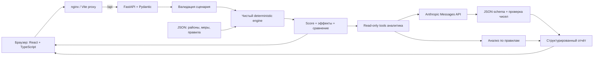
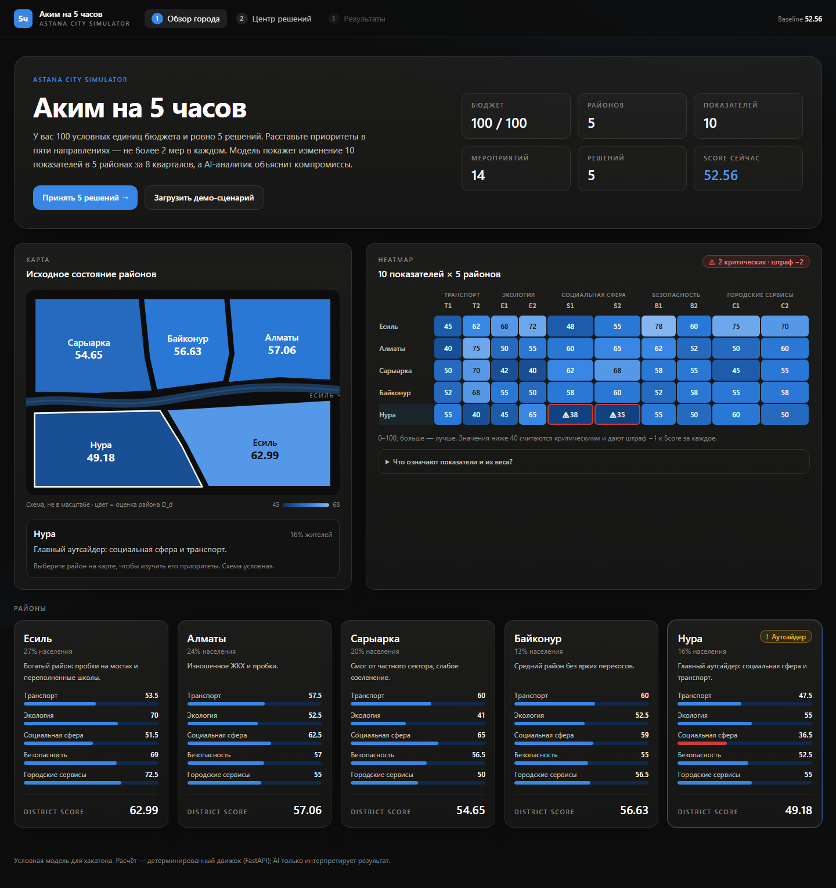
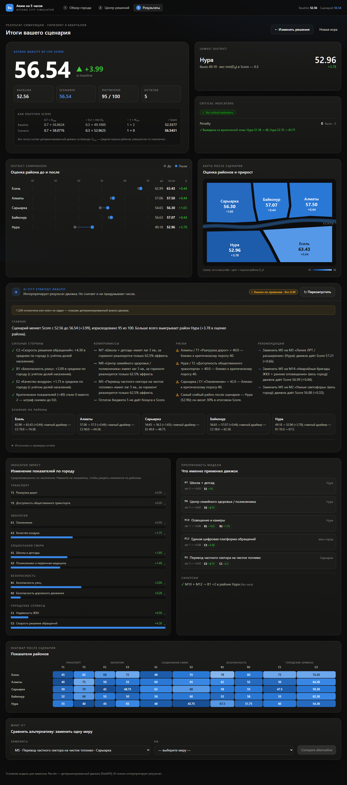

# Аким на 5 часов

**ASTANA CITY SIMULATOR** — интерактивный симулятор городских решений. У каждого игрока одинаковые пять районов, 100 условных единиц и ровно пять мероприятий. На горизонте восьми кварталов движок рассчитывает изменения десяти показателей, неравенство между районами и итоговый Quality of Life Score. Аналитик объясняет компромиссы и сравнивает альтернативы.

Математическая модель — источник всех результатов. LLM интерпретирует уже рассчитанные данные и не назначает стоимость, эффекты или Score. Без API-ключа приложение полностью работает с явно обозначенным детерминированным отчётом по правилам.

**Данные учебные и синтетические.** Названия районов взяты для демонстрации; показатели, доли населения и эффекты не являются официальной статистикой Астаны. Схема города не является географической картой. Персональные данные не используются.

## Быстрый запуск

Нужен Docker с работающим движком Linux containers и Docker Compose v2. Из корня проекта:

```sh
docker compose up --build
```

- Приложение: <http://localhost:8080>
- API health: <http://localhost:8080/api/health>
- Swagger / OpenAPI: <http://localhost:8000/docs>

`.env` и API-ключ для этого запуска не нужны. Первая сборка скачивает образы и зависимости. Frontend запускается после успешной проверки здоровья backend. Для остановки: `docker compose down`; для просмотра состояния: `docker compose ps`.

Чтобы включить LLM, скопируйте [.env.example](.env.example) в `.env` в корне, задайте `ANTHROPIC_API_KEY` и модель, доступную вашему аккаунту, затем снова выполните `docker compose up --build`. В PowerShell файл копируется командой `Copy-Item .env.example .env`, в bash — `cp .env.example .env`.

## Демо за две минуты

1. Откройте приложение: исходный Score **52.56**, бюджет **100**, пять районов.
2. Нажмите **Загрузить демо-сценарий** на обзоре. Система выберет M7 / Нура, M8 / Нура, M10 / Нура, M12 / город, M5 / Сарыарка и сразу выполнит расчёт.
3. Проверьте: пять решений, затраты **95**, остаток **5**. Для просмотра выбранных мер перейдите к редактированию; загрузка демо из центра решений оставляет возможность вручную запустить расчёт.
4. Итог: **56.54**, прирост **+3.99**, критических показателей **0**, минимальный район — Нура **52.96**. В отчёте видно, использована ли LLM или анализ по правилам.
5. В **What if?** замените M5 на городскую M6 и сравните: затраты **90**, Score **56.76**, разница относительно основного сценария **+0.22**. Оба варианта рассчитывает тот же backend.
6. Начните новую игру, чтобы вернуться к одинаковому исходному состоянию.

## Архитектура



Production frontend собирается Vite и раздаётся nginx. Запросы `/api` проксируются на `backend:8000` внутри Compose, поэтому в браузере используется один origin. Ключи передаются только процессу backend; они не входят в frontend bundle или Docker build context. Сервер не хранит игровые сессии: клиент отправляет выборы при каждом расчёте.

```text
backend/
  app/
    main.py                 FastAPI, CORS
    data/                   districts.json, initiatives.json, rules.json
    models/schemas.py       Контракты каталога, сценария и результата
    routers/api.py          HTTP API
    services/
      catalog.py            Загрузка исходных данных
      validation.py         Правила и доступность мероприятий
      simulation.py         Эффекты, лаги, синергии, сравнение
      scoring.py            D_d, D_avg, N_crit, итоговый Score
      ai_analysis.py        Tools, LLM, grounding, отчёт по правилам
  tests/                    Unit и API tests
frontend/
  src/components/           Обзор, решения, результаты, аналитик, What if?
  src/api.ts                Типизированные HTTP-запросы
  src/types.ts              Контракты интерфейса
  nginx.conf                Production reverse proxy
docker-compose.yml
.env.example
```

Стек: Python 3.12, FastAPI, Pydantic, Uvicorn, Anthropic Python SDK; React 19, TypeScript, Vite, Tailwind CSS; pytest, HTTPX, Oxlint; Docker и nginx. База данных, регистрация и фоновые очереди для основного сценария не нужны.

## Локальная разработка

Нужны Python 3.12+ и Node.js 22.12+. Два терминала.

Backend — PowerShell:

```powershell
cd backend
python -m venv .venv
.\.venv\Scripts\python.exe -m pip install -r requirements-dev.txt
.\.venv\Scripts\python.exe -m uvicorn app.main:app --reload --port 8000
```

Backend — macOS / Linux:

```sh
cd backend
python3 -m venv .venv
.venv/bin/python -m pip install -r requirements-dev.txt
.venv/bin/python -m uvicorn app.main:app --reload --port 8000
```

Frontend — отдельный терминал:

```sh
cd frontend
npm ci
npm run dev
```

Открыть <http://localhost:5173>. Vite проксирует `/api` на локальный backend. Корневой `.env` загружается backend через `python-dotenv`. Для разработки frontend обычный запуск не требует `.env`.

## Переменные окружения

| Переменная | По умолчанию | Назначение |
| --- | --- | --- |
| `ANTHROPIC_API_KEY` | пусто | Ключ LLM, только backend |
| `ANTHROPIC_AUTH_TOKEN` | пусто | Альтернативная авторизация SDK, если она поддерживается вашим подключением |
| `ANTHROPIC_MODEL` | `claude-opus-5` | Модель с поддержкой tools и structured outputs; доступ зависит от аккаунта |
| `AI_DISABLED` | `false` | `true` принудительно включает отчёт по правилам без сетевых запросов |
| `AI_TIMEOUT_SECONDS` | `120` | Общий бюджет времени вызовов аналитика; максимум 180 секунд |
| `FRONTEND_PORT` | `8080` | Порт браузера при запуске Compose |
| `BACKEND_PORT` | `8000` | Порт API / Swagger при запуске Compose |
| `CORS_ORIGINS` | `http://localhost:5173,http://localhost:8080` в Compose | Разрешённые origins через запятую; при nginx proxy CORS не нужен |
| `LOG_LEVEL` | `INFO` | Уровень логирования backend |
| `VITE_PROXY_TARGET` | `http://127.0.0.1:8000` | Переменная процесса Vite для другого dev backend |
| `VITE_API_URL` | пусто | Необязательный публичный base URL API при сборке frontend; стандартная сборка использует текущий origin |

`VITE_*` доступны браузеру и не предназначены для секретов. Docker-сборка frontend исключает `.env` и использует относительный `/api`. Для отдельного внешнего API потребуется явная настройка сборки frontend и CORS. Недоступность модели или провайдера приводит к отчёту `source="rule_based"` с пояснением причины, а не к вымышленному AI-ответу.

## Данные и математический движок

Source of truth — файлы [districts.json](backend/app/data/districts.json), [initiatives.json](backend/app/data/initiatives.json), [rules.json](backend/app/data/rules.json). Пять районов: Есиль, Алматы, Сарыарка, Байконур, Нура. Четырнадцать мероприятий в пяти направлениях. Все показатели находятся в диапазоне `[0, 100]`, больше означает лучше.

| Показатель | Смысл | Вес |
| --- | --- | --- |
| T1 | Разгрузка дорог | 0.10 |
| T2 | Доступность общественного транспорта | 0.10 |
| E1 | Озеленение | 0.09 |
| E2 | Качество воздуха | 0.11 |
| S1 | Школы и детсады | 0.11 |
| S2 | Поликлиники и первичная медицина | 0.11 |
| B1 | Безопасность улиц | 0.09 |
| B2 | Безопасность дорожного движения | 0.09 |
| C1 | Надёжность ЖКХ | 0.10 |
| C2 | Скорость решения обращений | 0.10 |

Сумма весов — 1. Доли населения: Есиль 0.27, Алматы 0.24, Сарыарка 0.20, Байконур 0.13, Нура 0.16.

Для района `d` и показателя `k`, при горизонте `H = 8` кварталов и лаге `L_m`:

```text
realized_share_m = (8 - L_m) / 8
I'_(d,k) = clip(I_(d,k) + Σ(effect_(m,k) × realized_share_m) + synergy_(d,k), 0, 100)

D_d    = Σ(w_k × I'_(d,k))
D_avg  = Σ(population_share_d × D_d)
N_crit = количество пар (район, показатель), где I'_(d,k) < 40
Score  = clip(0.7 × D_avg + 0.3 × min(D_d) - 1.0 × N_crit, 0, 100)
```

Городские меры применяются ко всем районам, районные — только к выбранному. Эффекты сначала суммируются, затем один раз ограничиваются диапазоном: порядок выбора не влияет на результат. Синергии применяются после учёта лагов и не масштабируются лагом. Например, M7 повышает S1 на `16 × (8−3)/8 = 10`, а не на 16. Итоговые изменения городских индикаторов взвешены по доле населения.

Числа внутри движка сохраняют точность; UI округляет результат до двух знаков. Прирост рассчитывается из исходных значений, поэтому разность отображаемых `56.54 − 52.56` может отличаться от отображаемого прироста `+3.99`.

| Контроль | Базовый город | Демо |
| --- | ---: | ---: |
| D_avg | 56.8624 | 58.0776 |
| Минимальный D_d | 49.18 | 52.9625 |
| N_crit | 2 | 0 |
| Score по формуле | 52.55768 | 56.54307 |
| Score в интерфейсе | 52.56 | 56.54 |

В исходном задании указан baseline `52.55728`; прямая подстановка приведённых там D_avg и min(D_d) даёт `52.55768`. Движок использует формулу без подгонки, а тест проходит заданный допуск ±0.001. Базовый город доступен отдельно для сравнения; пустой набор решений не считается допустимым игровым сценарием.

## Правила и ограничения

- Ровно **5** различных мероприятий; стоимость не превышает **100**.
- Не более **2** мероприятий одного направления. Выбор одного мероприятия из каждого направления не обязателен: демо содержит две социальные меры.
- Для `district` требуется существующий район; для `city` поле `district_id` отсутствует или равно `null`.
- M1 + M3 запрещены при любом размещении.
- M4 + M7 запрещены только в одном районе; в разных разрешены.
- M5 + M13 запрещены только в одном районе; в разных разрешены.
- Неизвестные меры, неизвестные районы и дубликаты отклоняются.
- Остаток бюджета не даёт бонуса. Показатель ровно **40** не является критическим.
- Invalid-сценарий не получает итогового Score. Backend повторно проверяет все правила независимо от UI.

| Синергия | Бонус | Район |
| --- | --- | --- |
| M1 + M2 | T1 +2 | Район M1 |
| M10 + M12 | B1 +2 | Район M10 |
| M5 + M6 | E2 +2 | Район M5 |

Контрольный бюджетный набор `M9 + M11 + M10 + M12 + M4` стоит **61** и допустим при указании районов для районных мер, например всех в Нуре. Обзор и черновой предпросмотр не заменяют окончательную серверную проверку.

## AI City Strategy Analyst

`POST /api/ai/analyze` принимает только выбор мероприятий и, опционально, альтернативу. Backend заново валидирует и рассчитывает их. Переданные браузером значения Score не становятся источником данных.

LLM получает рассчитанное состояние и read-only инструменты:

- `get_city_state()` — исходное состояние и описание модели;
- `get_selected_scenario()` — выбранные меры и стоимость;
- `get_simulation_result()` — итог и разложение Score;
- `get_indicator_changes()` — рассчитанные изменения;
- `compare_scenarios()` — сравнение через тот же движок;
- `find_best_swaps()` — перебор допустимых замен одной меры с расчётом результатов.

Используется Anthropic Messages API с tools и [JSON structured outputs](https://platform.claude.com/docs/en/build-with-claude/structured-outputs). Ответ содержит `summary`, `strengths`, `tradeoffs`, `risks`, `district_impacts`, `recommendations`; при сравнении добавляется `alternative_verdict`. Системные инструкции запрещают самостоятельный пересчёт и числа, отсутствующие в данных. После ответа сервер проверяет JSON-структуру, полноту отчёта и наличие чисел в рассчитанном контексте. Не прошедший проверку ответ заменяется отчётом по правилам.

При отсутствии ключа, `AI_DISABLED=true`, таймауте или ошибке провайдера deterministic engine продолжает работать. UI явно показывает источник `llm` или `rule_based`, имя модели при наличии и пояснение fallback. Анализ по правилам строится из результатов движка и реального перебора допустимых замен; это не имитация вызова LLM.

Проверка чисел проверяет их наличие в исходных данных, но не доказывает семантическую корректность каждого утверждения LLM. Итоговые числовые карточки всегда показывают результат движка отдельно от текста аналитика.

## API

Интерактивные схемы запросов и ответов: <http://localhost:8000/docs>. Через nginx доступны все пути с `/api`.

| Метод и путь | Назначение |
| --- | --- |
| `GET /api/health` | `{"status":"ok"}`; не вызывает LLM |
| `GET /api/game` | Правила, районы, показатели, 14 мер, baseline, demo scenario |
| `POST /api/simulation/validate` | Проверка выбора, бюджет, ошибки, доступность мер и заблокированные районы |
| `POST /api/simulation/calculate` | Валидный результат: Score, районы до/после, индикаторы, реализованные эффекты, синергии |
| `POST /api/simulation/compare` | Результаты двух сценариев и их различия |
| `POST /api/ai/analyze` | Структурированный отчёт по рассчитанному сценарию и необязательной альтернативе |

Тело для `validate` и `calculate`:

```json
{
  "selections": [
    {"measure_id": "M7", "district_id": "nura"},
    {"measure_id": "M8", "district_id": "nura"},
    {"measure_id": "M10", "district_id": "nura"},
    {"measure_id": "M12", "district_id": null},
    {"measure_id": "M5", "district_id": "saryarka"}
  ]
}
```

Для `compare`: `{"base": {"selections": [...]}, "alternative": {"selections": [...]}}`.
Для `ai/analyze`: `{"scenario": {"selections": [...]}, "alternative": null}` или объект альтернативного сценария.

`validate` возвращает HTTP 200 с `valid=false` для нарушений игровых правил. `calculate` и `ai/analyze` возвращают HTTP 422 для недопустимых сценариев; ошибки содержатся в `detail`. Сравнение сохраняет отчёты валидации обоих вариантов; разница Score отсутствует, если хотя бы один вариант невалиден. Некорректная JSON-структура обрабатывается FastAPI / Pydantic как HTTP 422.

## Проверки

После установки `requirements-dev.txt`, из каталога `backend`:

```powershell
.\.venv\Scripts\python.exe -m pytest -q
```

В macOS / Linux: `.venv/bin/python -m pytest -q`. Тесты выполняются локально и не требуют ключа провайдера.

Покрываются контрольные Score, минимальный допустимый набор, превышение бюджета, число мер, дубликаты, лимит направления, все несовместимости в одинаковых и разных районах, лаги, синергии, границы `[0,100]`, порог `<40`, городское и районное применение, независимость от порядка, сравнение и HTTP-контракты. Отдельные тесты аналитика проверяют корректную работу без LLM, структуру отчёта и отклонение неподтверждённых ответов.

Из каталога `frontend`:

```sh
npm run lint
npm run build
```

Проверка конфигурации контейнеров: `docker compose config --quiet`. После запуска `docker compose ps` должен показать здоровые backend и frontend; `GET http://localhost:8080/api/health` проверяет также reverse proxy. Ручная проверка полного пути: новый город → демо → расчёт → отчёт → замена меры → сравнение → новая игра.

## Скриншоты и GIF

Реальные снимки приложения: обзор города и результат демо.





[Мобильная версия](docs/screenshots/mobile.png). Для короткой записи пути «загрузка демо → расчёт → сравнение» зарезервирован `docs/demo.gif`; GIF пока не добавлен.

[Центр решений с выбранным демо-сценарием](docs/screenshots/decisions.png).

## Ограничения

- Учебная линейная модель с фиксированным горизонтом: нет обратных связей, неопределённости, эксплуатационных расходов, межрайонных потоков и долгосрочной динамики.
- Наборы данных и веса фиксированы и не откалиброваны на официальной статистике.
- Сценарии не сохраняются на сервере; после перезагрузки нужно собрать или загрузить демо заново.
- Реальный LLM требует доступной модели, ключа и сети. Числовой grounding уменьшает риск неподтверждённых чисел, но не гарантирует правильность интерпретации.
- Compose рассчитан на локальную демонстрацию и слушает loopback. Для публичного размещения потребуются HTTPS, ограничения запросов, управление секретами и контроль доступа к платному AI endpoint.
- Нет случайных событий и таблицы лидеров: повторный расчёт одинаковых данных даёт одинаковый результат.

## Дальнейшее развитие

Версионируемые калиброванные наборы данных; сохранение и экспорт сценариев; анализ чувствительности весов и неопределённости; пошаговый горизонт по кварталам; сравнение нескольких стратегий; доступность интерфейса и дополнительные языки; воспроизводимые события с явным seed. Для реальных решений — валидация модели экспертами и подключение проверяемых агрегированных источников.
