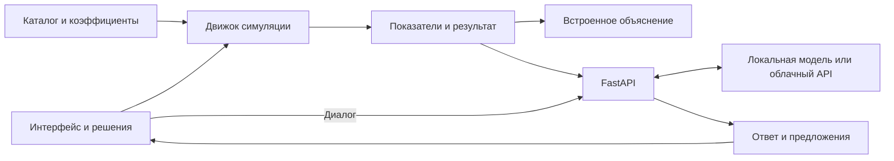
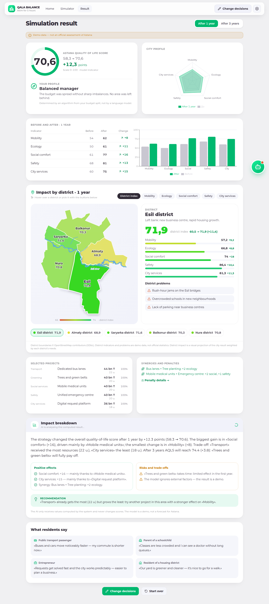

# QalaBalance — Аким на 5 часов

**Распределите бюджет города и узнайте, к чему приведут ваши решения.**

QalaBalance — интерактивный симулятор управления Астаной с AI-помощником. Вы выбираете проекты, распределяете 100 бюджетных единиц между пятью сферами и сравниваете состояние города через один и три года.

Проект для **HackAlem AI**, кейс Astana Innovations «Аким на 5 часов».

**Русский · Қазақша · English**

[Быстрый запуск](#быстрый-запуск) · [Настройка AI](#ai-помощник) · [Карта 2ГИС](#карта-2гис) · [Проверки](#проверки) · [Документация](#документация)


> Все показатели, бюджеты, коэффициенты и результаты являются демонстрационными. Симулятор не представляет официальную оценку или прогноз развития Астаны.

## Возможности

| Возможность | Что можно сделать |
|---|---|
| Городской бюджет | Выбрать по одному проекту в каждой из пяти сфер: транспорт, озеленение, социальная сфера, безопасность и городские сервисы |
| Каталог проектов | Сравнить 30 проектов по эффектам, стоимости, срокам, рискам и расходам на обслуживание |
| Результаты | Посмотреть индекс качества жизни AQLS, изменения пяти показателей, 10 возможных синергий и штрафы модели |
| AI-помощник | Задать свободный вопрос, продолжить разговор, обсудить решения или получить предложение по бюджету |
| Карта города | Изучить пять районов модели на карте 2ГИС или автономной SVG-схеме |
| Три языка | Переключить интерфейс, каталог, обучение, результаты и язык новых ответов AI между RU, KK и EN |
| Удобство | Пройти обучение из восьми шагов, выбрать тему оформления и продолжить работу с сохранённым в браузере черновиком |

### Как проходит симуляция

1. Ознакомьтесь с исходным состоянием города: стартовый AQLS — **58,3**.
2. Выберите **пять проектов** — по одному в каждой сфере.
3. Распределите **ровно 100 единиц**, от **5 до 40** на сферу. Условный курс: **1 единица = 2 млрд ₸**.
4. Запустите расчёт и сравните горизонты **1 год / 3 года**.
5. Изучите эффекты, риски и объяснение результата, затем измените решения и сравните новую стратегию.

Результат рассчитывает детерминированный движок в браузере: одинаковый выбор и бюджет дают одинаковые показатели. AI объясняет расчёт и помогает с решениями; предлагаемые изменения применяются только по кнопке пользователя.

## Быстрый запуск

Понадобятся **Git**, **Node.js 22.12+** и **Python 3.12**. Команды ниже предназначены для **Windows PowerShell**.

### 1. Получите проект

```powershell
git clone https://github.com/BAITC-Hacks/hack-e9acc52d-bezdarez.git
cd hack-e9acc52d-bezdarez
```

### 2. Запустите backend

Выполните из корня проекта:

```powershell
python -m venv backend/.venv
backend/.venv/Scripts/python.exe -m pip install -r backend/requirements-dev.txt
if (-not (Test-Path -LiteralPath .env)) { Copy-Item -LiteralPath .env.example -Destination .env }
backend/.venv/Scripts/python.exe -m uvicorn app.main:app --app-dir backend --host 127.0.0.1 --port 8000
```

### 3. Запустите frontend

Откройте второй терминал в корне проекта:

```powershell
npm.cmd --prefix frontend ci
npm.cmd --prefix frontend run dev
```

Откройте **[localhost:5173](http://localhost:5173)**. Если порт занят, используйте адрес, который напечатает Vite. Запросы `/api` автоматически направляются на backend по адресу `http://127.0.0.1:8000`.

Симулятор работает без ключей API. Для диалога подключите модель по инструкции ниже; без неё результаты сопровождаются встроенным объяснением. Для карты 2ГИС нужен отдельный браузерный ключ; без ключа доступна схема районов.

При следующих запусках достаточно команд `uvicorn` и `npm.cmd --prefix frontend run dev` — повторная установка зависимостей не требуется.

<details>
<summary>Запуск на Linux / macOS</summary>

Из корня склонированного проекта, в первом терминале:

```bash
python3 -m venv backend/.venv
backend/.venv/bin/python -m pip install -r backend/requirements-dev.txt
test -f .env || cp .env.example .env
backend/.venv/bin/python -m uvicorn app.main:app --app-dir backend --host 127.0.0.1 --port 8000
```

Во втором терминале, также из корня проекта:

```bash
npm --prefix frontend ci
npm --prefix frontend run dev
```

Для AI используйте отдельно настроенный совместимый сервер или облачный API. Комплект локальной модели из `scripts/setup_local_ai.py` предназначен для Windows.

</details>

<details>
<summary>Запуск через Docker Compose</summary>

Из корня проекта с подготовленным `.env`:

```bash
docker compose up --build
```

Приложение: **[localhost:8080](http://localhost:8080)**. API: **[localhost:8000/api/health](http://localhost:8000/api/health)**.

Compose запускает frontend и backend. Для AI требуется отдельно доступный сервер: адрес `127.0.0.1` внутри контейнера относится к самому контейнеру. Переносимая Windows-модель в контейнере автоматически не запускается. Текущая Docker-сборка не передаёт ключ 2ГИС и использует SVG-схему.

</details>

## AI-помощник

Помощник поддерживает свободный диалог: объяснения, математику, программирование, работу с текстом и вопросы о симуляторе. Он получает последние сообщения разговора, а для вопросов об игре — контекст проектов, бюджета и результатов. Доступны отмена запроса, повтор и начало нового диалога.

| Подключение | Настройка |
|---|---|
| Локально на Windows | `Qwen3.5-9B-Kazakh` от ISSAI, квантование Q4_K_M, llama.cpp / Vulkan. Установщик загружает около 5,7 ГБ и проверяет SHA-256 |
| Собственный сервер | OpenAI-совместимый API, например уже настроенная Ollama или vLLM |
| Облачный провайдер | Совместимый API; в `.env.example` приведён пример NVIDIA API Catalog |

**[Полная инструкция подключения AI →](docs/assistant.md)**

История сохраняется в браузере; сообщения и необходимый контекст отправляются выбранному провайдеру модели. Смена языка влияет на новые ответы, прежние сообщения остаются на исходном языке. Модель может ошибаться и не имеет встроенного интернет-поиска.

Если модель недоступна, чат показывает сообщение об ошибке и кнопку повтора. Экран результата при этом продолжает работать со встроенным объяснением, а подсказки по решениям доступны без AI.

## Карта 2ГИС

Скопируйте шаблон из корня проекта:

```powershell
if (-not (Test-Path -LiteralPath frontend/.env.local)) { Copy-Item -LiteralPath frontend/.env.example -Destination frontend/.env.local }
```

В `frontend/.env.local` укажите свой ключ с доступом к Map Tiles / MapGL JS API:

```dotenv
VITE_DGIS_API_KEY=ваш_браузерный_ключ
```

Перезапустите Vite. Для production ключ задаётся перед сборкой frontend. Это браузерный ключ: ограничения доменов и квоты настраиваются в кабинете 2ГИС.

Без ключа или при ошибке загрузки приложение использует SVG-схему. Контуры пяти районов модели приблизительные и не являются актуальными официальными административными границами.

**[Подключение и поведение карты →](docs/2gis.md)**

## Конфигурация

Корневой `.env` читает backend. Файл `frontend/.env.local` содержит настройки сборки frontend. Оба файла исключены из Git; примеры доступны в [.env.example](.env.example) и [frontend/.env.example](frontend/.env.example).

| Переменная | Назначение |
|---|---|
| `LLM_API_URL` | Адрес совместимого API, включая `/v1` |
| `LLM_MODEL` | Точное имя модели на выбранном сервере |
| `LLM_API_KEY` | Ключ AI-провайдера; остаётся на backend |
| `LLM_TIMEOUT_SECONDS` | Таймаут запроса: в шаблоне 25 секунд, для комплектной локальной модели — 90 |
| `LOCAL_AI_AUTOSTART` | `1` включает запуск установленной Windows-модели вместе с backend |
| `NVIDIA_API_KEY`, `NVIDIA_MODEL` | Необязательный резервный AI-провайдер |
| `CORS_ORIGINS` | Разрешённые адреса frontend для прямых запросов к API |
| `VITE_DGIS_API_KEY` | Браузерный ключ карты в `frontend/.env.local` |

Если backend работает на другом порту, задайте адрес перед запуском frontend, например:

```powershell
$env:VITE_PROXY_TARGET = 'http://127.0.0.1:8011'
npm.cmd --prefix frontend run dev
```

## Расчёт и архитектура

Индекс **Astana Quality of Life Score (AQLS)** объединяет пять показателей:

```text
AQLS = Мобильность × 0,25 + Экология × 0,20
     + Социальный комфорт × 0,20 + Безопасность × 0,20
     + Городские сервисы × 0,15 − штрафы
```

Отдача от бюджета растёт по формуле `min(1.15, sqrt(бюджет / рекомендованный бюджет))`. Движок учитывает эффекты проектов, синергии, перекос финансирования, долгосрочные множители и обслуживание. Коэффициенты и исходные данные находятся в [frontend/src/data](frontend/src/data), расчёт — в [calculateSimulation.ts](frontend/src/lib/calculateSimulation.ts).



| Слой | Технологии |
|---|---|
| Интерфейс | React 19, TypeScript, Vite 8, Tailwind CSS 4, Recharts, Lucide |
| Движок | Чистые TypeScript-функции, Zod для проверки данных |
| Backend | Python, FastAPI, Pydantic, Uvicorn |
| AI | OpenAI-совместимый клиент, llama.cpp для комплектной локальной модели |
| Проверки | Vitest, pytest, TypeScript, Oxlint |
| Контейнеры | Docker Compose, nginx |

### Структура проекта

```text
frontend/src/
  pages/                   Старт, выбор проектов, результаты
  components/              Карта, помощник, обучение, графики и настройки
  data/                    Проекты, районы, коэффициенты и переводы
  lib/                     Расчёт, локализация, хранение и API-клиенты
  types/                   Типы данных
backend/app/
  main.py                  Приложение FastAPI
  explain.py               API объяснений и помощника
  assistant.py             История, контекст и проверка действий
  llm.py                   Клиент языковых моделей
  local_ai.py              Запуск локальной модели
backend/tests_explain/     Тесты API
scripts/setup_local_ai.py  Установка локальной модели для Windows
docs/                     Инструкции, ТЗ и скриншоты
```

### API

| Метод | Путь | Назначение |
|---|---|---|
| `GET` | `/api/health` | Состояние backend, настройка AI и готовность локальной модели |
| `POST` | `/api/assist` | Вопрос, история разговора, язык `ru` / `kk` / `en` и контекст решений |
| `POST` | `/api/explain` | Объяснение уже рассчитанного результата на выбранном языке |

Backend проверяет входные данные и ответы модели. Объяснения результатов проходят дополнительные проверки чисел и кэшируются с учётом языка. Предлагаемые помощником действия проверяются по каталогу проектов и ограничениям бюджета.

## Проверки

Из корня проекта после установки зависимостей:

```powershell
npm.cmd --prefix frontend test
npm.cmd --prefix frontend run build
npm.cmd --prefix frontend run lint -- src
backend/.venv/Scripts/python.exe -m pytest -c backend/pytest.ini backend/tests_explain -q
```

На Linux/macOS используйте `npm` и `backend/.venv/bin/python`. Автотесты API используют подставные ответы провайдера; действующий ключ и запущенная модель для них не требуются.

Для ручной проверки выберите пять проектов, распределите 100 единиц, сравните оба горизонта и переключите язык. Выбор и бюджет должны сохраниться. При подключённой модели проверьте свободный вопрос и продолжение разговора.

## Скриншоты

Сохранённые примеры интерфейса; внешний вид отдельных элементов может отличаться от текущей версии.

| Выбор проектов | Карта районов |
|---|---|
|  |  |
| **Результат на английском** | **Тёмная тема на казахском** |
|  |  |

## Документация

- [AI-помощник и подключение моделей](docs/assistant.md)
- [Настройка карты 2ГИС](docs/2gis.md)
- [Техническое задание](docs/tz.txt)
- [Шаблон конфигурации backend](.env.example)
- [Шаблон конфигурации карты](frontend/.env.example)

Контуры районов основаны на данных © участников OpenStreetMap, лицензия ODbL. Комплектная модель ISSAI Qwen3.5-9B-Kazakh распространяется по Apache 2.0, llama.cpp — по MIT; ссылки на источники приведены в [инструкции AI](docs/assistant.md). Каталог проектов и параметры симуляции подготовлены командой на основе ТЗ.
