# Аким на 5 часов — QalaBalance

**AI-симулятор управления городом.** Пользователь получает 100 виртуальных бюджетных единиц, принимает пять решений — по одному проекту в каждой сфере города — и видит, как они меняют условный **Astana Quality of Life Score (AQLS)** через 1 год и через 3 года. AI объясняет последствия простым языком, но баллы считает только детерминированный движок.

> ⚠️ **Данные демонстрационные.** Все показатели, коэффициенты и результаты — модельные. Это не официальная оценка и не прогноз для города Астаны. Персональные данные не собираются, регистрации нет.

Хакатон HackAlem AI · кейс Astana Innovations «Аким на 5 часов» · ТЗ: [docs/tz.txt](docs/tz.txt)

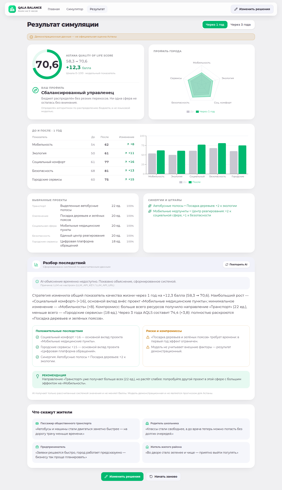

## Основные возможности

- **AI-помощник** (кнопка в правом нижнем углу) — агент, который смотрит на ваши решения и предлагает действия с кнопкой «Применить»: выбрать проект для синергии, выровнять бюджет, перейти к незаполненной сфере, запустить симуляцию. Отвечает на вопросы («как снизить пробки?») через NVIDIA LLM (`POST /api/assist`), без ключа — по данным каталога.
- **Обучение** — 8 шагов с подсветкой элементов интерфейса; запускается автоматически при первом входе в симулятор, повторяется из настроек или из помощника.
- **Настройки** — светлая / тёмная / системная тема, интерфейс на русском, казахском и английском (включая каталог проектов, районы, аналитику, обучение; AI отвечает на выбранном языке), статус AI-сервиса, сброс решений.
- **Окно штрафов** — формулы штрафов модели и штрафы текущего решения по сферам + реальные штрафы по КоАП РК (ст. 505, 592, 597, 336, 434) в тенге по МРП 2026 = 4 325 ₸, со ссылками на официальные тексты.
- **30 проектов и 10 синергий** — по 6 проектов в каждой сфере (15 из ТЗ + 15 дополнительных: ЛРТ, газификация частного сектора, набережная Есиля, теплосети, защита от паводков и др.).
- **Интерактивная карта Астаны** — реальные границы пяти районов (Есиль, Алматы, Сарыарка, Байконыр, Нура) и река Есиль из OpenStreetMap. При наведении район приподнимается с анимацией и показывает индекс, пять показателей относительно города и характерные проблемы; слои карты переключаются по показателям. На экране результата карта показывает, как изменения распределились по районам.
- **Бюджет в тенге** — 100 бюджетных единиц по условному курсу 1 ед. = 2 млрд ₸ (всего 200 млрд ₸); суммы в тенге показаны на карточках проектов, ползунках, в шапке и в результате.
- **Стартовый экран** — правила, бюджет, исходное состояние города (AQLS 58, пять показателей, радар, проблемы города), предупреждение о демо-данных.
- **Экран решений** — 5 сфер × 6 проектов. Карточка: описание, мин./рекомендуемый/макс. бюджет, эффекты, риски, скорость результата, обслуживание. Ползунки 5–40 ед., счётчики «распределено / осталось / превышение», живой прогноз AQLS и радар, диаграмма бюджета, понятные ошибки. Кнопка запуска заблокирована, пока распределение некорректно.
- **Экран результата** — анимированный AQLS «до → после», таблица и столбцы по пяти показателям, переключатель **1 год / 3 года**, синергии и штрафы, профиль стратегии (алгоритмический), положительные эффекты и риски, AI-объяснение, рекомендация, реакции четырёх условных жителей.
- **AI только объясняет.** `POST /api/explain` отправляет в LLM уже рассчитанные значения; ответ проверяется по JSON-схеме и на отсутствие выдуманных чисел. Если AI недоступен или ответ не прошёл проверку — мгновенно показывается шаблонное объяснение, экран результата никогда не блокируется.
- **«Изменить решения»** сохраняет выбор (LocalStorage), **«Начать заново»** сбрасывает.
- Адаптивность: 1366×768, 1920×1080, планшет, мобильный от 360 px; навигация с клавиатуры, текстовые значения рядом с диаграммами, ошибки не только цветом.

## Технологический стек

| Слой | Технологии |
|---|---|
| Frontend | React 19, TypeScript, Vite, Tailwind CSS 4, Recharts, Zod, Lucide Icons, LocalStorage |
| Simulation Engine | Чистые TypeScript-функции в `frontend/src/lib` (без UI и без сети) |
| AI Explanation API | Python 3.12, FastAPI, Pydantic, OpenAI-совместимый клиент на `urllib` |
| LLM | **Локально**: Ollama + `qwen2.5:7b` на GPU ноутбука (проверено на RTX 4050 6 ГБ, ~20 с на объяснение). **Резерв**: NVIDIA API Catalog (`meta/llama-3.3-70b-instruct`). Цепочка: локальная модель → NVIDIA → системная аналитика |
| Тесты | Vitest (движок), pytest (API), E2E-проверка в Chromium |
| Деплой | Docker Compose (nginx + uvicorn) |

Стек отличается от рекомендованного в ТЗ (Next.js) — ТЗ это допускает (п. 15). Вместо Next.js API Route используется отдельный FastAPI-сервис: ключ LLM живёт только в его окружении.

## Архитектура

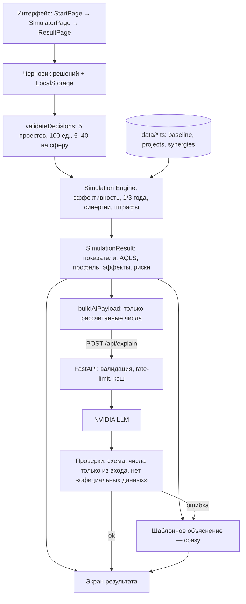

Математика полностью отделена от AI: движок работает в браузере мгновенно, без сети; backend нужен только для AI-объяснения.

## Структура проекта

```text
frontend/src/
  pages/            StartPage, SimulatorPage, ResultPage
  (components)      + TopBar, CityMap, Assistant, Tour, SettingsModal, PenaltiesModal, Modal
  components/       BudgetHeader, CategoryNavigation, ProjectCard, BudgetSlider,
                    ScoreGauge, ScoreRadarChart, BudgetChart, ResultComparison,
                    AiExplanation, CitizenReactionCard, StrategyProfile, ui
  data/             baseline.ts (исходные показатели, веса, курс ед. → ₸), projects.ts (каталог 15 проектов),
                    synergies.ts, fallbackTexts.ts (реакции жителей), categoryVisuals.ts,
                    districts.ts (модельные данные районов), astanaMap.ts (геометрия из OSM),
                    realFines.ts (штрафы КоАП РК, МРП 2026)
  lib/              calculateSimulation, calculateProjectEffect, calculateSynergies,
                    calculatePenalties, determineProfile, generateFallbackExplanation,
                    districtProjection, advisor (советы помощника), i18n (ru/kk, тема),
                    buildAiPayload, explainApi, storage, *.test.ts
  types/            project.ts, simulation.ts, ai.ts (Zod-схема ответа AI)
backend/app/
  main.py           FastAPI-приложение
  explain.py        POST /api/explain, POST /api/assist, GET /api/health, промпты, проверки, rate-limit
  llm.py            OpenAI-совместимый клиент (NVIDIA API Catalog / Brev)
backend/tests_explain/   тесты API без сети
docs/               tz.txt (ТЗ), screenshots/
docker-compose.yml, .env.example
```

Настройка проектов, коэффициентов, исходных показателей и синергий — только через `frontend/src/data/*.ts` (админ-панель в MVP не требуется).

## Формула расчёта AQLS

**1. Эффективность бюджета** (убывающая отдача, п. 10.2 ТЗ):

```
efficiency   = min(1.15, sqrt(allocatedBudget / recommendedBudget))
effect1y     = baseEffect × efficiency
effect3y     = baseEffect × efficiency × longTermMultiplier
```

**2. Показатели сфер:** `score = clamp(baseline + Σ effects + Σ synergyBonus, 0, 100)`.

**3. Итоговый индекс** (п. 10.1):

```
AQLS = Мобильность×0.25 + Экология×0.20 + Соц. комфорт×0.20 + Безопасность×0.20 + Сервисы×0.15 − штрафы
```

**4. Штрафы:**
- за перекос (по каждой сфере): `max(0, 10 − budget) × 0.25 + max(0, budget − 30) × 0.15`;
- за обслуживание (только горизонт 3 года): `max(0, Σ maintenanceCost − 12) × 0.5`.

**5. Синергии** (п. 11): 6 пар проектов, например «Адаптивные светофоры + Цифровая платформа обращений» → +2 к городским сервисам.

**6. Районы (визуализация).** Стартовые показатели районов модельные, их взвешенное по условной доле населения среднее равно стартовым показателям города (±1, закреплено тестом). Городское изменение показателя переносится на район с коэффициентом потребности `clamp(1 + (город − район) / 40, 0.7, 1.3)`: отстающий район растёт заметнее. AQLS по-прежнему считается только на уровне города.

**7. Профиль стратегии** — алгоритм, не LLM: транспорт + сервисы ≥ 55% бюджета → «Технократ»; разброс бюджетов ≤ 10 ед. → «Сбалансированный управленец»; иначе — по сфере с наибольшим бюджетом.

Стартовый AQLS по весам ТЗ: 54×0.25 + 50×0.2 + 61×0.2 + 68×0.2 + 60×0.15 = **58.3** (в ТЗ округлено до 58). Расчёт детерминирован: одинаковые решения всегда дают одинаковый результат (порядок ввода не важен) — это закреплено тестом.

Долгосрочные множители и расходы на обслуживание для проектов, которых нет в примере ТЗ (п. 10.3), заданы командой в `data/projects.ts` и тоже являются модельными.

## Установка и локальный запуск

Требования: **Node.js 20.19+** и **Python 3.11+**. Ключ API для запуска **не нужен** — без него работает всё, кроме AI-текста (показывается шаблонное объяснение).

```bash
git clone https://github.com/BAITC-Hacks/hack-e9acc52d-bezdarez.git
cd hack-e9acc52d-bezdarez
cp .env.example .env          # необязательно: впишите LLM_API_KEY для AI-объяснений
```

**Терминал 1 — backend (AI Explanation API):**

```bash
cd backend
python3 -m venv .venv
.venv/bin/pip install -r requirements-dev.txt        # Windows: .venv\Scripts\pip ...
.venv/bin/uvicorn app.main:app --port 8000
```

**Терминал 2 — frontend:**

```bash
cd frontend
npm ci
npm run dev
```

Откройте <http://localhost:5173>. Vite проксирует `/api` на `http://127.0.0.1:8000`.

**Вариант через Docker** (если установлен Docker Compose v2): `docker compose up --build` → <http://localhost:8080>.

## Локальная LLM (необязательно)

AI-объяснение и ответы помощника может генерировать модель прямо на ноутбуке — без интернета и ключей:

```bash
# Linux/WSL: https://ollama.com/download  (или распаковать релиз в ~/.local/ollama)
ollama serve &
ollama pull qwen2.5:7b          # ~4,7 ГБ; для GPU с 4 ГБ — qwen2.5:3b
cp .env.example .env            # LLM_API_URL=http://127.0.0.1:11434/v1, LLM_MODEL=qwen2.5:7b
```

Перезапустите backend — `GET /api/health` покажет `"providers": ["qwen2.5:7b"]`. Если локальная модель недоступна, backend автоматически переходит на NVIDIA API (при заданном `NVIDIA_API_KEY`), а затем на системную аналитику — экран результата не ждёт AI.

## Переменные окружения

Файл `.env` в корне репозитория (в Git не попадает, шаблон — [.env.example](.env.example)). Читает **только backend**; в браузер ключ не передаётся.

| Переменная | Назначение | По умолчанию |
|---|---|---|
| `LLM_API_URL` | Основной OpenAI-совместимый endpoint: локальный Ollama `http://127.0.0.1:11434/v1`, свой инстанс (Brev/vLLM) или NVIDIA | — |
| `LLM_MODEL` | Модель основного провайдера | `qwen2.5:7b` в `.env.example` |
| `LLM_API_KEY` | Ключ основного провайдера (для Ollama не нужен) | — |
| `LLM_TIMEOUT_SECONDS` | Таймаут запроса к основному провайдеру | `90` |
| `NVIDIA_API_KEY` | Резерв: ключ NVIDIA API Catalog (`nvapi-…`) | — |
| `NVIDIA_MODEL` | Модель резервного провайдера | `meta/llama-3.3-70b-instruct` |
| `CORS_ORIGINS` | Разрешённые origin для прямых запросов к API | `http://localhost:5173,http://localhost:8080` |
| `LOG_LEVEL` | Уровень логов backend | `INFO` |

## Проверка основного сценария

1. Откройте приложение → стартовый экран: AQLS **58,3**, пять показателей, радар, предупреждение о демо-данных.
2. «Начать управление». Кнопка «Запустить симуляцию» неактивна, справа — «Выберите проект в категории …».
3. Выберите: **Выделенные автобусные полосы**, **Посадка деревьев и зелёных поясов**, **Мобильные медицинские пункты**, **Единый центр реагирования**, **Цифровая платформа обращений**.
4. Бюджеты: Транспорт **22**, Озеленение **20**, Социальная сфера **20**, Безопасность **20**, Городские сервисы **18** (Осталось: 0). Попробуйте поставить Транспорт 30 — появится «Бюджет превышен на 8 единиц», запуск заблокирован.
5. «Запустить симуляцию» → AQLS **58,3 → 70,6** (1 год), профиль «Сбалансированный управленец», 2 синергии (автобусные полосы + деревья, медпункты + центр реагирования).
6. Переключите «Через 3 года» → **74,4**: экология растёт с 61 до 66,7 за счёт посадки деревьев (×1,8).
7. Блок «Объяснение последствий»: с ключом — бейдж «AI-объяснение · модель», без ключа — «Шаблонное объяснение» с пометкой, что AI недоступен.
8. «Изменить решения» — выбор сохранён; «Начать заново» — всё сброшено.

**Автотесты:**

```bash
cd frontend && npm test            # 26 тестов: движок, районы, синергии, эффекты: формулы, синергии, штрафы, валидация, детерминизм
cd backend && .venv/bin/python -m pytest   # 13 тестов API: схема, выдуманные числа, фолбэк, rate-limit, утечка ключа
cd frontend && npm run build && npx oxlint src
```

Проверка API вручную: `curl http://localhost:8000/api/health` → `{"status":"ok","llm":{"configured":…}}`.

## API

`POST /api/assist` — вопрос AI-помощнику: `{"question": "…", "context": {"decisions": […], "allocated": 100}}` → `{"success": true, "answer": "…", "model": "…"}` или `{"success": false, "useFallback": true}` (тогда фронтенд отвечает по данным каталога).

`POST /api/explain` — тело `{"simulationResult": {horizon, overallBefore, overallAfter, scoresBefore, scoresAfter, selectedProjects, synergies, penalties, strategyProfile}}` (формат п. 13.2 ТЗ).

- Успех: `{"success": true, "data": {summary, positives[3], risks[2–3], recommendation, citizenReactions[4]}, "model": "…"}`
- Ошибка AI: `{"success": false, "useFallback": true, "reason": "…"}`

Защита: входные данные валидируются (диапазоны 0–100, длины строк), 20 запросов в минуту с одного IP, одинаковые запросы кэшируются, ключ не логируется и не возвращается.

## Скриншоты

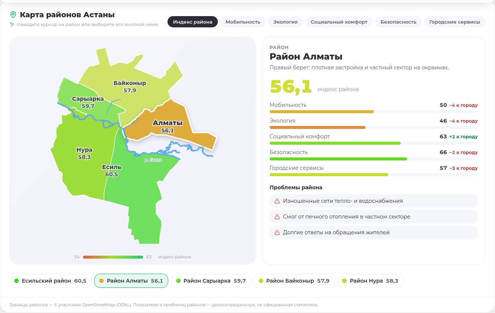

| AI-помощник | Обучение |
|---|---|
| 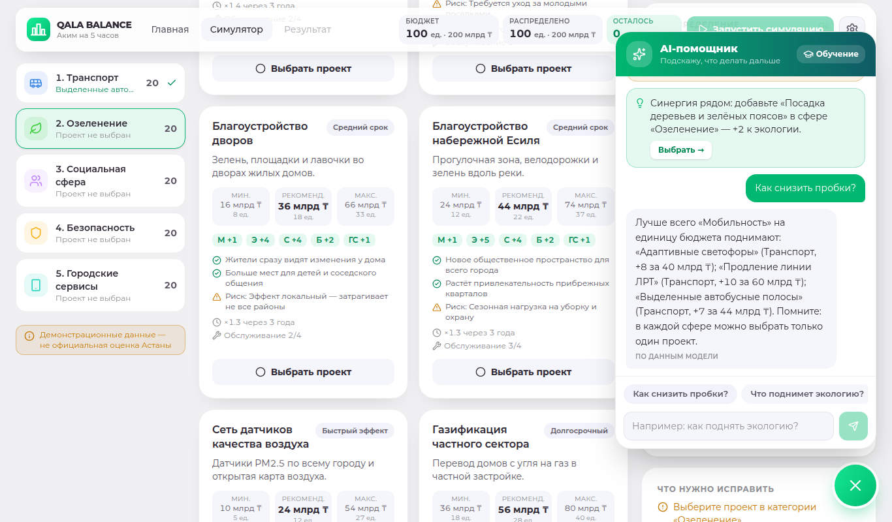 | 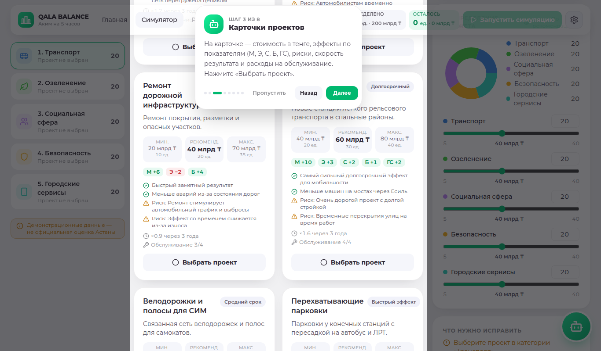 |
| **Штрафы (КоАП РК)** | **Тёмная тема · қазақша** |
| 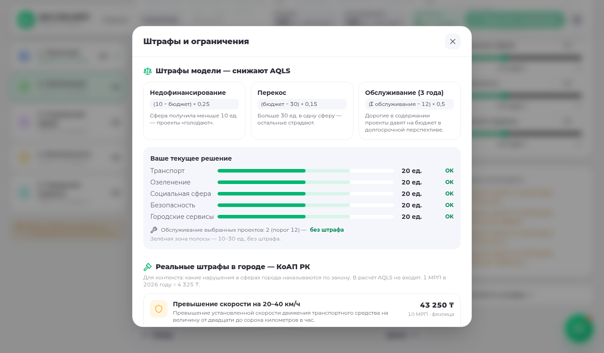 | 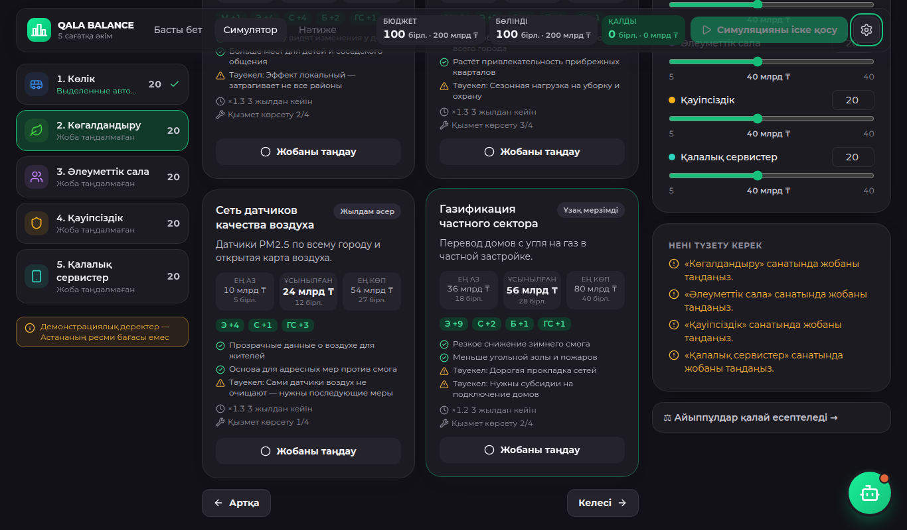 |

| Старт | Решения |
|---|---|
| 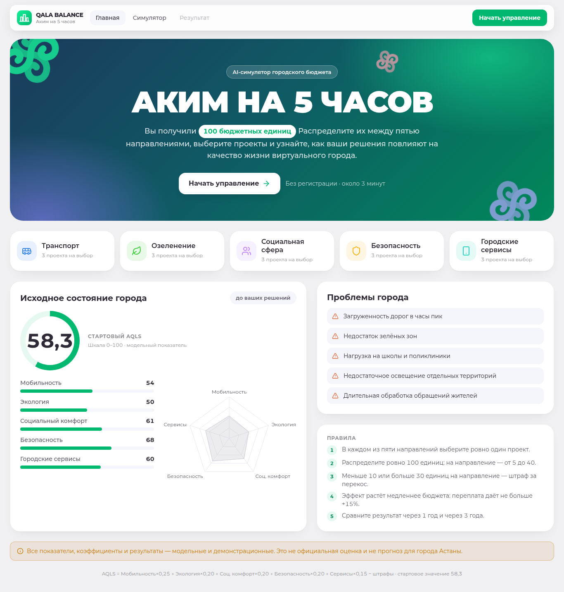 | 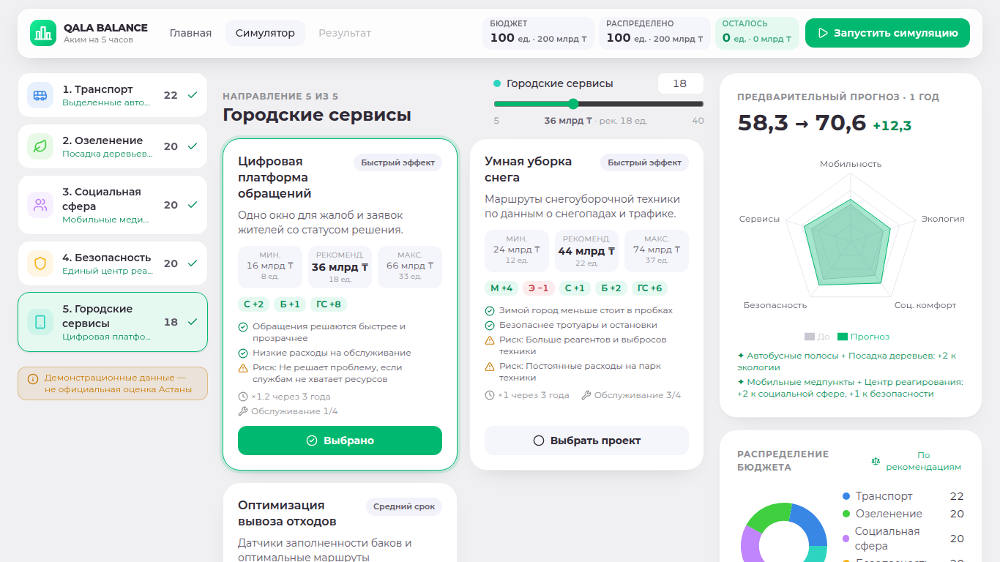 |
| **Результат, 3 года** | **Мобильная версия** |
| 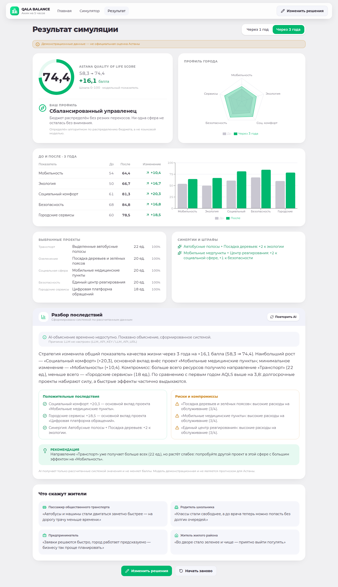 | 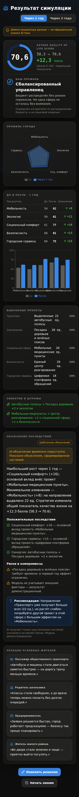 |

## Развёрнутая версия

Ссылка будет добавлена после деплоя.

## Сторонние компоненты

React, Vite, Tailwind CSS, Recharts, Zod, Lucide (MIT/ISC); FastAPI, Pydantic, Uvicorn, python-dotenv (MIT/BSD). LLM: модели NVIDIA API Catalog по их лицензиям. Штрафы — Кодекс РК об административных правонарушениях (https://adilet.zan.kz/rus/docs/K1400000235), МРП 2026 — Закон РК № 239-VIII «О республиканском бюджете на 2026–2028 годы» (https://adilet.zan.kz/rus/docs/Z2500000239). Границы районов и река — © участники OpenStreetMap, лицензия ODbL (данные получены через Nominatim/Overpass, упрощены). Каталог проектов, коэффициенты, показатели районов и тексты — синтетические, подготовлены командой по ТЗ.
